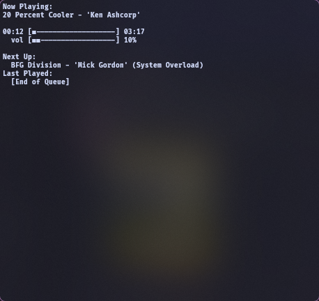

# Flare-Music-Player

This is just a basic music player that I made for my own use, but I think it's kind of cool.  
I'll probably move from NAudio to LibVLCSharp eventually to add cross-platform usage, but for now I'm going to leave it.

